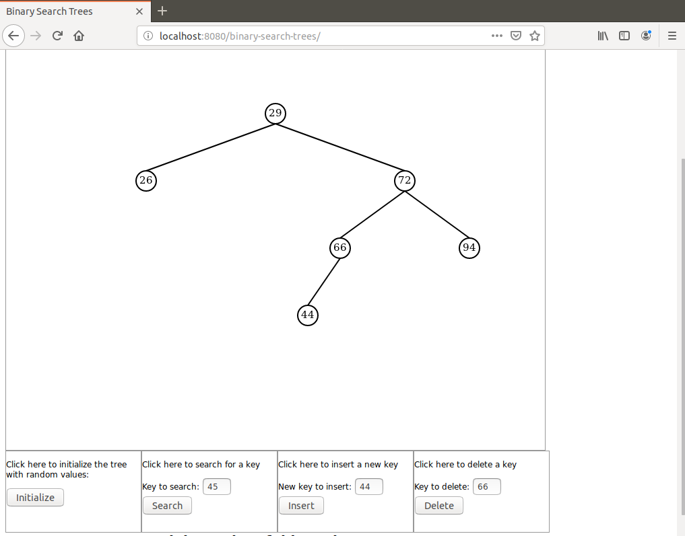

# binary-search-trees-java-demo
Binary Search Tree Java based demonstration on Canvas using AJAX for communication between browser and server

I present here a Java based demonstration of a Binary Search Tree. The BST itself is implemented in Java on server side and a BST instance is attached as argument to the Http session.

The tree depth is limited to 4 to keep the display simple.

The BST implementation closely follows Cormen's textbook except that I always favor the non-recursive implementation over the recursive one.

I chose to make the Tree class generic.

To launch the demo run the command `mvn spring-boot:run` in project directory. When the appllication has started open a browser and hit URL `localhost:8080/binary-search-trees`.

Here is a screen shot that can be seen during the demo:

For a video demo follow this link:

https://youtu.be/qMq2Nph4RYk 

Dominique Ubersfeld, Cachan, France
